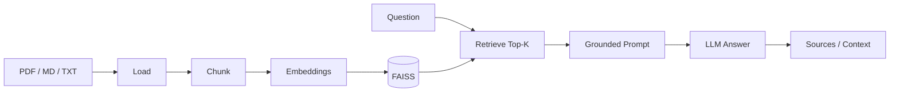

<div align="center">

# RAG Knowledge Base Demo

**Drop in your documents and ask grounded questions with a lightweight local RAG stack.**

[English](./README.md) | [简体中文](./README.zh-CN.md)

[](https://streamlit.io)
[](https://www.langchain.com/)
[](https://faiss.ai/)
[](./LICENSE)

</div>

---

## 🎯 What it is

A compact RAG project that demonstrates the full retrieval pipeline:

**documents → chunks → embeddings → vector search → grounded answer → source inspection**

The goal is not to hide the pipeline behind a chat box. The UI exposes retrieval steps so you can inspect what happened.

---

## 🎬 Demo

<div align="center">


</div>

---

## ⚡ Quick Start

```bash
git clone https://github.com/Dream22180971/rag-knowledge-base-demo.git
cd rag-knowledge-base-demo

pip install -r requirements.txt
cp .env.example .env
streamlit run app.py
```

Then open `http://localhost:8501`.

Configure the required model / embedding credentials in `.env`.

---

## 🔄 RAG Flow



---

## ✨ Features

| Feature | Purpose |
|---|---|
| Multi-format loading | ingest PDF, Markdown and TXT |
| Recursive chunking | preserve useful local context |
| FAISS retrieval | local vector search |
| Source display | inspect supporting chunks |
| Pipeline timing | see where retrieval / generation time goes |
| Index cache | avoid rebuilding every startup |

---

## 🔍 What to inspect when answers are wrong

RAG quality is rarely just “the model is bad”.

Check:

1. Was the right document loaded?
2. Did chunking split the relevant context badly?
3. Did retrieval return the correct chunks?
4. Is `top_k` appropriate?
5. Does the prompt force the answer to stay grounded?
6. Is the source content itself sufficient?

This is why the pipeline visualization matters.

---

## 🧩 Architecture

```text
Streamlit UI
    │
    ▼
RAG Pipeline
    ├── loaders
    ├── text splitter
    ├── embeddings
    ├── FAISS
    └── LLM generation
```

Dependencies include LangChain community integrations, FAISS, PyPDF, PyMuPDF and python-docx.

---

## ⚠️ Current Limitations

- requires configured embedding / LLM credentials
- local FAISS is suitable for a demo and moderate local datasets, not every enterprise scale
- retrieval quality depends heavily on document quality and chunking
- this repository is a learning/reference implementation, not a production knowledge platform

---

## 🗺 Roadmap

- [x] PDF / Markdown / TXT
- [x] FAISS retrieval
- [x] source inspection
- [x] pipeline timing
- [x] index persistence
- [ ] richer Word / spreadsheet ingestion
- [ ] conversational memory
- [ ] multiple knowledge bases
- [ ] Docker packaging
- [ ] evaluation dataset and retrieval metrics

---

## 📄 License

[MIT](./LICENSE)

<div align="center">

**A useful RAG demo should show not only the answer, but why that answer was retrieved.**

</div>
