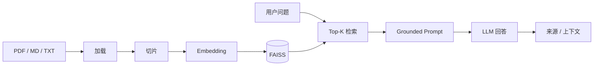

<div align="center">

# RAG 智能知识库问答

**把文档放进去，用一套轻量本地 RAG 流程进行可追溯知识库问答。**

[English](./README.md) | [简体中文](./README.zh-CN.md)

[](https://streamlit.io)
[](https://www.langchain.com/)
[](https://faiss.ai/)
[](./LICENSE)

</div>

---

## 🎯 它是什么

一个把完整 RAG 链路跑通的轻量项目：

**文档 → 切片 → Embedding → 向量检索 → 基于上下文回答 → 查看来源**

重点不是只做一个聊天框，而是把检索过程展示出来，让你知道答案是怎么来的。

---

## 🎬 演示

<div align="center">


</div>

---

## ⚡ 5 分钟快速开始

```bash
git clone https://github.com/Dream22180971/rag-knowledge-base-demo.git
cd rag-knowledge-base-demo

pip install -r requirements.txt
cp .env.example .env
streamlit run app.py
```

访问 `http://localhost:8501`。

在 `.env` 中配置所需的模型 / Embedding 凭据。

---

## 🔄 RAG 流程



---

## ✨ 核心能力

| 能力 | 作用 |
|---|---|
| 多格式加载 | 支持 PDF、Markdown、TXT |
| 递归切片 | 尽量保留局部上下文 |
| FAISS 检索 | 本地向量搜索 |
| 来源展示 | 查看支持答案的原文片段 |
| 流程耗时 | 观察检索 / 生成耗时 |
| 索引缓存 | 避免每次启动重建索引 |

---

## 🔍 回答不准时先看什么

RAG 效果不好，不一定只是“模型不行”。

建议依次检查：

1. 正确文档有没有加载？
2. 切片是不是把关键上下文切碎了？
3. 检索结果有没有命中真正相关内容？
4. `top_k` 是否合适？
5. Prompt 有没有限制模型必须基于上下文？
6. 原始知识本身是否足够回答？

这也是为什么这个项目会把执行链路可视化。

---

## 🧩 技术架构

```text
Streamlit UI
    │
    ▼
RAG Pipeline
    ├── loaders
    ├── text splitter
    ├── embeddings
    ├── FAISS
    └── LLM generation
```

依赖包含 LangChain community integrations、FAISS、PyPDF、PyMuPDF 和 python-docx。

---

## ⚠️ 当前限制

- 需要配置可用的 Embedding / LLM 凭据
- 本地 FAISS 适合 Demo 与中小规模本地数据，并不覆盖所有企业级规模
- 检索质量高度依赖文档质量和切片策略
- 当前定位是学习 / 工程参考，不是完整生产知识库平台

---

## 🗺 路线图

- [x] PDF / Markdown / TXT
- [x] FAISS 检索
- [x] 来源展示
- [x] 流程耗时
- [x] 索引持久化
- [ ] 更丰富的 Word / 表格解析
- [ ] 多轮上下文
- [ ] 多知识库
- [ ] Docker
- [ ] 评测数据集与检索指标

---

## 📄 License

[MIT](./LICENSE)

<div align="center">

**好的 RAG Demo 不只展示答案，也应该展示为什么会检索到这个答案。**

</div>
